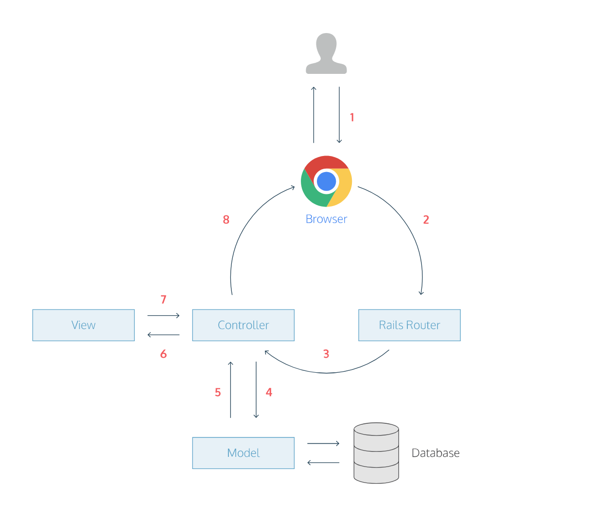

# What is MVC?

## MVC (Model, View, Controller)

1. Model >> ActiveRecord:

* Contains data for the application (often linked to a database)
* Contains state of the application (e.g. what orders a customer has)
* Contains all business logic

2. View >> ActionView:
* Generates the user interface which presents data to the user
* Passive, i.e. doesn’t do any processing
* Views work is done once the data is displayed to the user.
* Many views can access the same model for different reasons

3. Controller >> ActionController:

* Receive events from the outside world (usually through views)
* Interact with the model

The Model View Controller principle divides the work of an application into three [subsystems](https://www.tutorialspoint.com/ruby-on-rails/rails-framework) . 

# HOW IT WORKS
1. A user opens his browser, types in a URL, and presses Enter. When a user presses Enter, the browser makes a request for that URL.
2. The request hits the Rails router (config/routes.rb).
3. The router maps the URL to the correct controller and action to handle the request.
4. The action receives the request, and asks the model to fetch data from the database.
5. The model returns a list of data to the controller action.
6. The controller action passes the data on to the view.
7. The view renders the page as HTML.
8. The controller sends the HTML back to the browser. The page loads and the user sees it.

